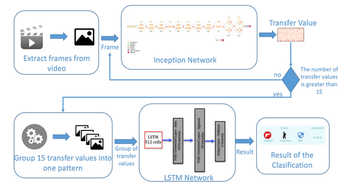

## Video Classification
**Aim** : Classify chunks of videos into respective classes. 

This project is implementation of the video classification method explained in [this](https://dzone.com/articles/video-analysis-to-detect-suspicious-activity-based) article.

1. Dataset Details: 
Collected dataset of videos. Created chunks of 15 frames(customizable) from videos. Divide those into train chunks and test chunks.
Dataset can be arranged as per our convenience. In this implementation datset is arrenged as follows, where each .mp4 file is a chunk of 15 frames.
 

Use name of video as class label e.g. for 1_1.mp4 label is 1, for 2_1.mp4 label is 2 etc.

2. Video classification architecture(explained in the article):
 

3. Implementation Details: 
   1. Feature Extraction on Image: We are using transfer learning technique to extract the features. We are extracting the result of the last pooling layer of Inception, which is a vector of 2,048 values (high-level feature map).This process is done frame by frame.To give our system a sense of the sequence. We are not considering single frames to make our final prediction. We take a group of frames(Here 15 frames) in order to classify not the frame but a segment of the video.
   2. Sequence Learning: Concatenate group of feature maps(15 Frames) into one single pattern, which will be the input of second neural network, the recurrent one, to obtain the final classification of our system.
